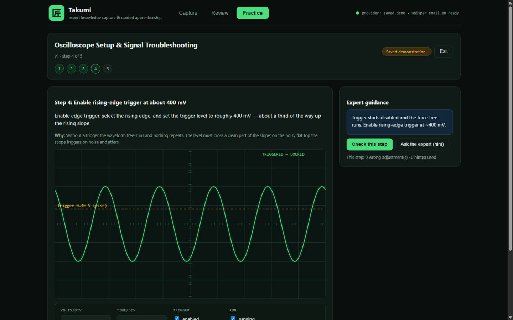
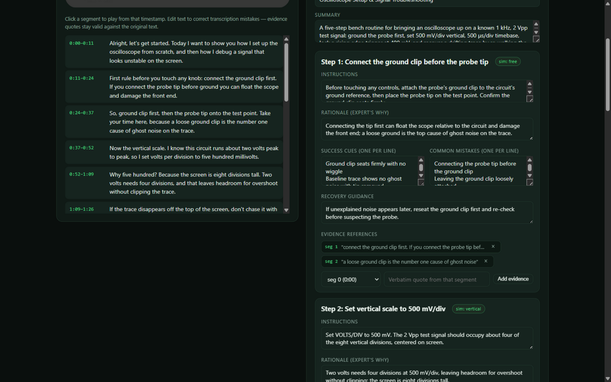
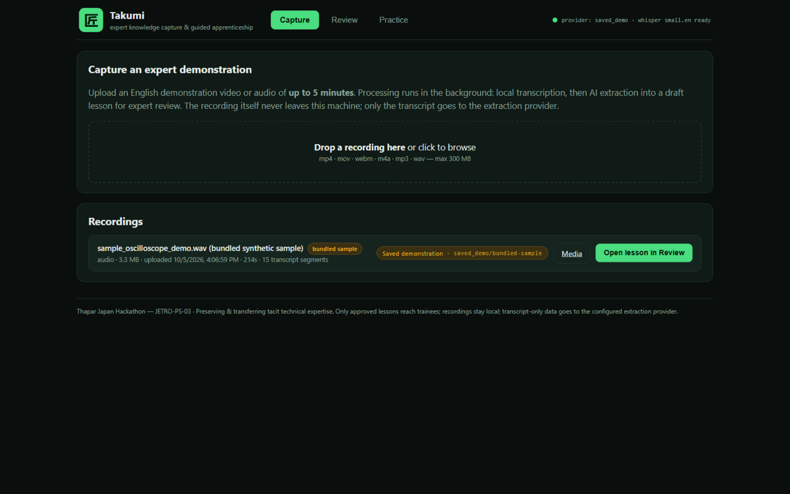

# 匠 Takumi — Expert Knowledge Capture & Guided Apprenticeship

<p align="center">
  
</p>

<p align="center">
  <em>"The expert stays the author. Nothing trains without approval."</em>
</p>

<p align="center">
  
  
  
  
  
  
</p>

**Takumi** (匠 — "artisan/master craftsman") turns a short expert demonstration video into a **verified, expert-approved, hands-on lesson** — so tacit knowledge survives the expert.

Built for **JETRO-PS-03 — "Preserving & Transferring Tacit Technical Expertise to Future Generations"**, Thapar Japan Hackathon 2026 (*Bridging Tradition and Innovation*).

- **Capture** a ≤10-minute demonstration video
- **Extract** structured lesson steps linked to verbatim transcript evidence
- **Review** as the expert: correct, answer flagged gaps, approve
- **Practice** as a trainee on an oscilloscope simulator that quotes the expert's own reasoning

Everything runs locally; the bundled sample lesson works **fully offline with zero API keys**.

---

## The problem

When a master technician retires, what leaves isn't the manual — it's the micro-decisions:

> *"Connect the ground clip **first** — tip-first can float the scope and damage the front end."*
> *"500 mV/div — two volts needs four of eight divisions, leaving headroom for overshoot."*
> *"Park the trigger level on the noisy flat top and the display jitters all day."*

A 5-minute demonstration holds dozens of decisions like these. Video preserves them but leaves them **unstructured, unverified, and untested** — nobody can search a recording, nothing links a claim to evidence, and watching is not doing. Classic knowledge-transfer (apprenticeship, written SOPs) doesn't scale to a retiring workforce, and pure-AI lesson generators hallucinate precisely the details that matter most.

**Takumi's answer:** AI drafts, the **expert owns**. Every generated claim must cite a verbatim transcript moment; unresolved reasoning becomes a flagged question only the expert can answer; only an **approved version** is ever served to trainees; and trainees prove competence in a simulator whose feedback quotes the expert's own words.

---

## How it works

```
 ┌──────────┐   ┌────────────┐   ┌─────────────────────┐   ┌──────────┐   ┌──────────┐
 │ CAPTURE  │ ▸ │  EXTRACT   │ ▸ │   REVIEW & APPROVE  │ ▸ │ PRACTICE │ ▸ │  MEASURE │
 └──────────┘   └────────────┘   └─────────────────────┘   └──────────┘   └──────────┘
 video/audio     transcribe +      expert corrects the      oscilloscope     attempts scored
 ≤ 10 min,       AI drafts a       transcript & draft,      simulator;       server-side and
 stored          structured        answers flagged          feedback quotes  tied to the
 locally         lesson draft      knowledge gaps           the expert       approved version
```

| Stage | What actually happens |
|---|---|
| **Capture** | Upload a video/audio demonstration (≤10 min, ≤1 GB). The file never leaves the machine. A background job pipeline transcribes locally with **faster-whisper** (`small.en`, CPU INT8, timestamped segments), with live progress and loud failure states. |
| **Extract** | A provider adapter turns the transcript into a structured lesson: steps with *instructions, rationale, success cues, common mistakes, recovery guidance* — each **evidence-linked to a verbatim transcript segment** — plus follow-up questions wherever reasoning is implied but unstated. |
| **Review** | The expert edits transcript and lesson, manages evidence, answers or explicitly dismisses every flagged question, and sees live validity indicators. **Invalid evidence references are rejected server-side.** |
| **Approve** | Approval requires: every step ≥1 valid evidence reference, every question resolved. Approved versions are immutable — edits create a new draft version; old attempts stay tied to the version they used. |
| **Practice** | Trainees see **approved lessons only** (server-enforced). Steps carrying a simulator task run on the canvas oscilloscope (VOLTS/DIV, TIME/DIV, trigger enable/edge/level with realistic drift-and-lock behaviour) and are scored; steps without one present as guided read-and-continue with the expert's evidence attached. Feedback always quotes the expert's own rationale, mistakes and recovery moves. |
| **Measure** | Attempts are recomputed server-side (clients can't fake scores) and stored against the exact approved lesson version — a record of who learned what, from which generation of the lesson. |

**Provenance is always visible.** Every lesson carries a badge: **Hosted AI** (NVIDIA NIM) · **Local AI** (Ollama) · **Saved demonstration** (offline bundled sample) — plus provider/model and a cached flag. You always know how a lesson was produced.

---

## Feature highlights

- 🔒 **Privacy-first:** recordings stay on-device; only transcript text can reach a hosted model, and only after you explicitly enable it.
- 🧾 **Evidence-verified:** hallucinated citations are structurally impossible — every quote must match the transcript (fuzzy-tolerant so expert transcript corrections don't invalidate evidence).
- 🛡 **No silent paid switching:** an explicitly requested provider that fails fails *loudly*; `auto` mode only steps down the ladder (hosted → local → offline).
- 🕹 **Real simulator physics:** the trace drifts until a valid trigger locks it — trainees *feel* what the expert described.
- 📊 **Tamper-proof scoring:** attempt scores are recomputed server-side from per-step results (wrong adjustments and hints used).
- 🔁 **Versioned lessons:** approved → edit → new draft version; attempt history stays pinned to the version each trainee actually saw.
- 📴 **One-command offline demo:** the backend serves the built frontend — `python run.py` is the whole show, no internet needed.
- 🧪 **16 automated end-to-end checks** covering approval gating, trainee visibility, evidence rejection, scoring integrity, restart persistence, and provider-failure paths (see [Verification](#verification)).
- ✅ **Live-verified both ways**: real video → local whisper → NVIDIA reasoning-model extraction → evidence-linked draft lesson; and the zero-network offline path.

---

## Architecture

```
takumi/
├── backend/                  FastAPI + SQLite (WAL) + local file storage
│   ├── app/
│   │   ├── main.py           app assembly · serves frontend/dist for offline demo
│   │   ├── config.py         every env knob (.env), double-gated NVIDIA access
│   │   ├── db.py             schema + indexes + helpers
│   │   ├── jobs.py           bounded background pipeline (1 worker), restart-safe
│   │   ├── seed.py           first-run bundled sample + synthetic WAV (wavetable gen)
│   │   ├── schemas.py        pydantic request validation
│   │   ├── services/
│   │   │   ├── transcription.py   faster-whisper small.en · CPU INT8 · ffprobe fast-fail
│   │   │   ├── extraction.py      provider adapter: NVIDIA NIM / Ollama / saved demo
│   │   │   └── validation.py      structure + evidence-vs-transcript checks
│   │   └── routers/          recordings · lessons · trainee · health
│   ├── fixtures/             sample_oscilloscope_demo.json (transcript + gold extraction)
│   ├── tests/                16 pytest end-to-end checks
│   └── run.py                uvicorn entry (127.0.0.1:8000)
├── frontend/                 React 18 + TypeScript + Vite (no other runtime deps)
│   └── src/
│       ├── pages/            CapturePage · ReviewPage · PracticePage
│       ├── components/       ScopeSimulator (canvas) · ProvenanceBadge · ErrorBoundary
│       ├── api.ts            typed API client (vite dev proxy /api → :8000)
│       └── types.ts          shared API types
├── scripts/make_deck.js      regenerates the Round-1 pitch deck (pptxgenjs)
└── docs/                     deck (pptx + pdf) · screenshots · verification report
```

**Data model:** `recordings → jobs → transcript_segments → lessons → lesson_versions (draft/approved) → attempts`, with an `extraction_cache` keyed on (transcript, provider, model, prompt version).

**Review workflow (expert):** evidence references are validated against both the original transcript text and the expert's corrections — editing a transcript never silently invalidates evidence, but inventing a quote always fails.

| Review page | Practice page |
|---|---|
|  |  |

---

## Quick start

**Prerequisites:** Python 3.11+ (3.13 tested), Node 18+ (24 tested). Optional: `ffmpeg`/`ffprobe` on PATH (fast duration pre-check), portable [Ollama](https://ollama.com) (local AI path).

```bash
# 1 — backend (first run seeds a bundled sample and processes it automatically)
cd backend
python -m pip install -r requirements.txt
python run.py                       # API + built frontend on http://127.0.0.1:8000

# 2 — frontend (dist/ is shipped prebuilt; rebuild after edits)
cd ../frontend
npm install
npm run build                       # tsc typecheck + vite build → dist/

# 3 — open http://127.0.0.1:8000
#     (or: npm run dev for the Vite dev server on http://localhost:5173)
```

**Offline demo in one command:** after building the frontend once, `python run.py` alone serves everything — the seeded sample lesson processes via the saved-demo path with no network and no keys. Walk through **Review → answer the 3 questions → Approve → Practice** and complete all 5 steps.

### Run the tests

```bash
cd backend && python -m pytest tests/ -q        # 16 passed
```

The suite covers: sample processing end-to-end · trainee 403 on unapproved lessons · approval blocked while questions are unresolved · out-of-range / non-matching evidence rejection · attempts tied to the approved version · server-side score recomputation · persistence across restart with orphaned-job cleanup · malformed & unavailable provider responses failing loudly · provider caching · auto-mode downward-only fallback · HTTP Range media streaming · oversized-upload fast-fail.

Full audit trail (automated + browser walkthrough + what's still pending): **[docs/VERIFICATION.md](docs/VERIFICATION.md)**.

---

## Configuration

Copy `backend/.env.example` → `backend/.env` (git-ignored, backend-only). Every knob:

| Variable | Default | Purpose |
|---|---|---|
| `TAKUMI_EXTRACTION_PROVIDER` | `saved_demo` | `auto` \| `nvidia` \| `ollama` \| `saved_demo` |
| `TAKUMI_NVIDIA_API_KEY` | — | NVIDIA NIM key (backend-only) |
| `TAKUMI_NVIDIA_ENABLED` | `false` | **Second gate** — set `true` only after confirming your free entitlement |
| `TAKUMI_NVIDIA_MODEL` | `meta/llama-3.1-8b-instruct` | NIM model id — live-verified with `nvidia/nemotron-3-nano-omni-30b-a3b-reasoning` (reasoning models: see `TAKUMI_LLM_*` rows) |
| `TAKUMI_NVIDIA_BASE_URL` | `https://integrate.api.nvidia.com/v1` | OpenAI-compatible endpoint |
| `TAKUMI_OLLAMA_BASE_URL` | `http://localhost:11434` | Local Ollama |
| `TAKUMI_OLLAMA_MODEL` | `qwen2.5:7b` | Local model |
| `TAKUMI_WHISPER_MODEL` | `small.en` | faster-whisper model |
| `TAKUMI_MAX_RECORDING_SECONDS` | `600` | Upload duration limit (10 min) |
| `TAKUMI_MAX_UPLOAD_MB` | `1000` | Upload size limit (1 GB) |
| `TAKUMI_LLM_TIMEOUT_SECONDS` | `60` | Per-request LLM timeout — use ~240 for reasoning models |
| `TAKUMI_LLM_MAX_ATTEMPTS` | `2` | Bounded retries (no runaway calls) |
| `TAKUMI_LLM_MAX_TOKENS` | `3000` | Generation budget — use ~8000 for reasoning models (thinking tokens) |

### Extraction providers

| Provider | Provenance badge | Network | Notes |
|---|---|---|---|
| **NVIDIA NIM** | Hosted AI | Required | Double-gated by design (key **and** explicit enable flag) — confirm your account's free entitlement first: [NIM docs](https://docs.api.nvidia.com/nim/docs/product) |
| **Ollama** (`qwen2.5:7b`) | Local AI | None | [Model](https://ollama.com/library/qwen2.5:7b); reachability probe is cached & non-blocking |
| **Saved demo** | Saved demonstration | None | Bundled sample extraction — the offline competition path |

Auto mode resolves in the order hosted → local → saved demo, and **never silently upgrades** to a paid provider.

---

## API reference

Base URL `http://127.0.0.1:8000/api` — interactive docs at `/docs` (Swagger).

| Method & path | Purpose |
|---|---|
| `POST /recordings` | Upload recording (multipart), auto-starts processing |
| `GET /recordings` · `GET /recordings/{id}` | List / detail incl. transcript & latest job |
| `GET /recordings/{id}/media` | Stream media (HTTP Range supported) |
| `PATCH /recordings/{id}/transcript/{seg}` | Expert transcript correction |
| `POST /recordings/{id}/reprocess` | Re-run extraction (fails if a job is active) |
| `GET /lessons` · `GET /lessons/{id}` | Lesson list / detail with versions & attempts |
| `GET /lesson-versions/{vid}` · `PUT` | Fetch / update a draft (auto-creates a new version when editing approved) |
| `POST /lesson-versions/{vid}/questions/{qid}` | Answer or dismiss a follow-up question |
| `POST /lesson-versions/{vid}/approve` | Approve (gated on valid evidence + resolved questions) |
| `GET /trainee/lessons` | **Approved lessons only** |
| `GET /trainee/lessons/{id}` | Approved version content (403 otherwise) |
| `POST /trainee/lessons/{id}/attempts` | Submit attempt (score recomputed server-side) |
| `GET /health` | Provider readiness & capability report |

---

## Performance notes (measured)

- `/api/health` ~6 ms — provider probes run in a background-refreshed cache; localhost probes never route through system proxies (`trust_env=False`).
- Oversized uploads fail in milliseconds — `ffprobe` duration pre-check runs **before** whisper loads.
- Extraction results cached by (transcript, provider, model, prompt version) — identical re-runs skip the LLM entirely.
- Bounded LLM calls: hard timeout, ≤2 attempts, truncated error bodies; one bounded worker thread processes jobs.
- GZip on API responses; SQLite WAL + indexes on all hot foreign keys; first-boot sample seeding ~2 s.

---

## Privacy & security posture

- Recordings and the database live in `backend/data/` (git-ignored) — nothing about a person's face or voice leaves the machine.
- API keys exist only in a git-ignored backend `.env`; the frontend never sees them.
- Hosted extraction (if enabled) receives **transcript text only**.
- Trainee-facing endpoints enforce approval server-side; there is no client-trusted state.

---

## Deployment (Vercel static demo)

The frontend deploys to Vercel as a **self-contained static demo**: the bundled sample lesson ships inside the JS bundle and a fetch shim serves the API client entirely in-browser — Review → answer questions → Approve → Practice (with scored attempts) works for any visitor, with state persisted in their own localStorage.

The real pipeline (recordings, whisper transcription, SQLite, NVIDIA/Ollama extraction) **cannot** run on serverless — it needs background jobs, a persistent disk and a 465 MB model — so it stays in the local desktop app; the demo's upload button explains this to visitors.

**Deploy** (a `vercel.json` in `frontend/` already sets `VITE_DEMO_MODE=1`):

- Dashboard: import `ISHPREET0101/takumi` on vercel.com, set **Root Directory** = `frontend`, deploy.
- CLI: `cd frontend && npx vercel --prod`

---

## Competition context — Thapar Japan Hackathon 2026

- **Problem statement:** [JETRO-PS-03](https://hack.tslasconnect.com/problem-statements) — Preserving & Transferring Tacit Technical Expertise to Future Generations.
- **Round 1 (due 18 Oct):** idea presentation — see `docs/Takumi_Round1_JETRO-PS-03.pptx` / `.pdf` (regenerate via `node scripts/make_deck.js`).
- **Finals (24–25 Oct):** live build & pitch; the demo runs offline from one command.
- **Business hypothesis (to be validated, not assumed):** organisation subscriptions for teams that must inherit skills — Japanese SMEs onboarding an Indian workforce, maintenance & vocational training institutes, manufacturing partners. Pilots would measure time-to-competence before any pricing claim.

## Roadmap

- [ ] Own consented expert recording for the competition demo (the current real video verified the pipeline but is a downloaded clip — record your own expert for originality and consent)
- [x] NVIDIA NIM extraction live — verified end-to-end on a real video with `nvidia/nemotron-3-nano-omni-30b-a3b-reasoning` (65 transcript segments → 5-step evidence-linked draft lesson)
- [ ] Ollama `qwen2.5:7b` processing-time benchmark
- [ ] Effectiveness study vs. written instructions (time, mistakes, assistance — disclosed sample size)
- [ ] Multi-lesson courses & trainee progress tracking
- [ ] Additional simulators beyond the oscilloscope

## Team

[ISHPREET0101](https://github.com/ISHPREET0101) and team — *add all members before submission*.

## Acknowledgments

- **JETRO** — problem statement and mentorship framework
- **Thapar School of Liberal Arts & Sciences (TSLAS)** & Thapar Institute — organisers of the Thapar Japan Hackathon 2026
- The open-source projects this stands on: FastAPI, faster-whisper, React, Vite, pptxgenjs

## License

[MIT](LICENSE)
