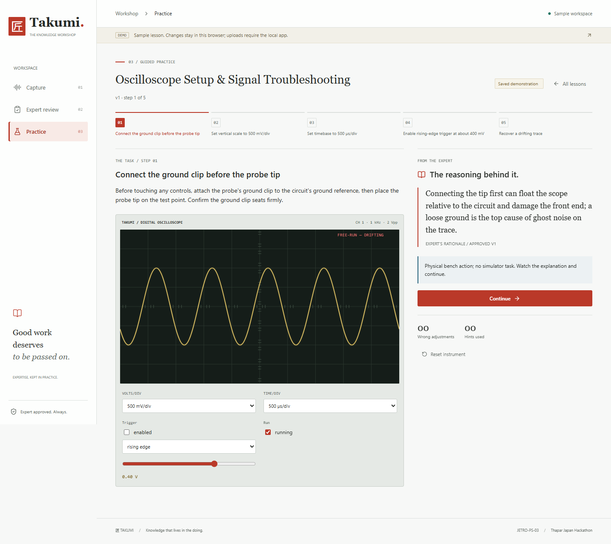
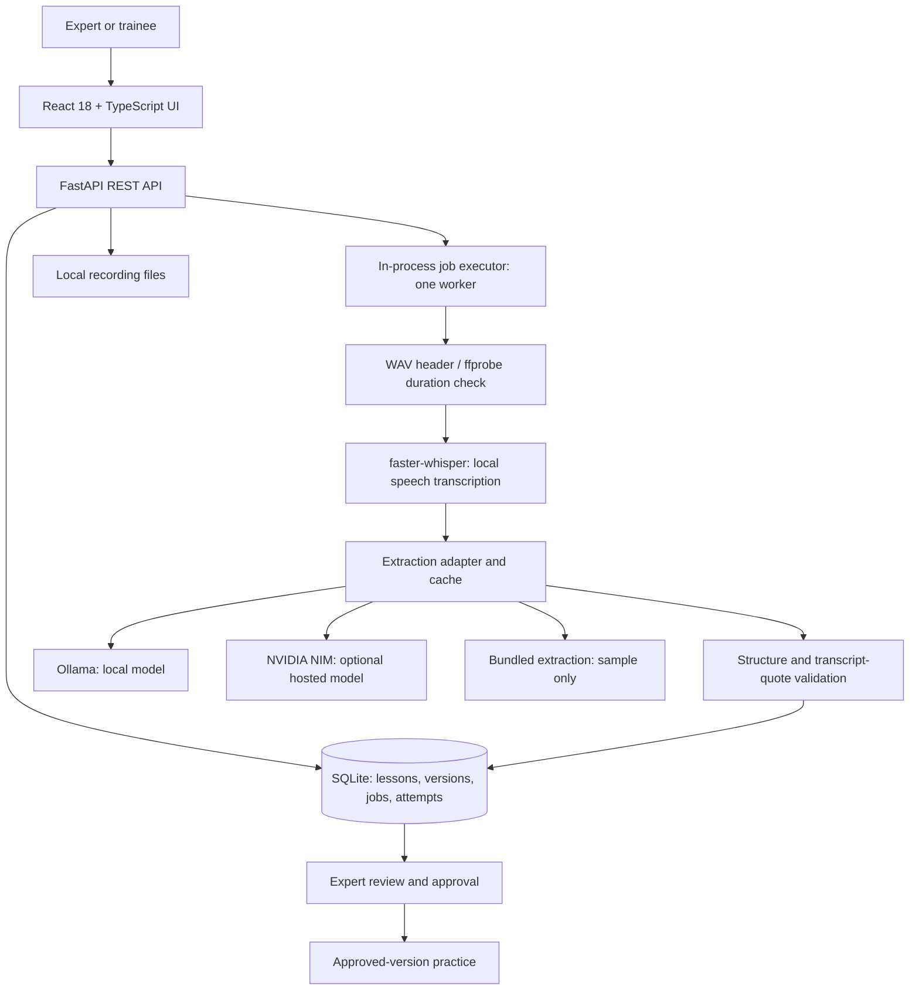
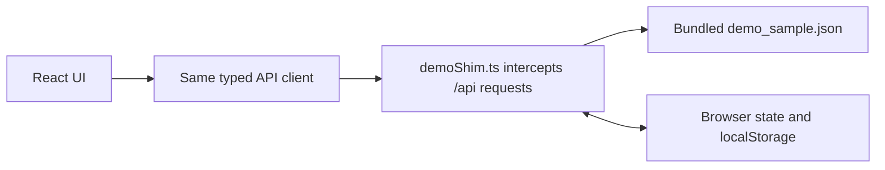
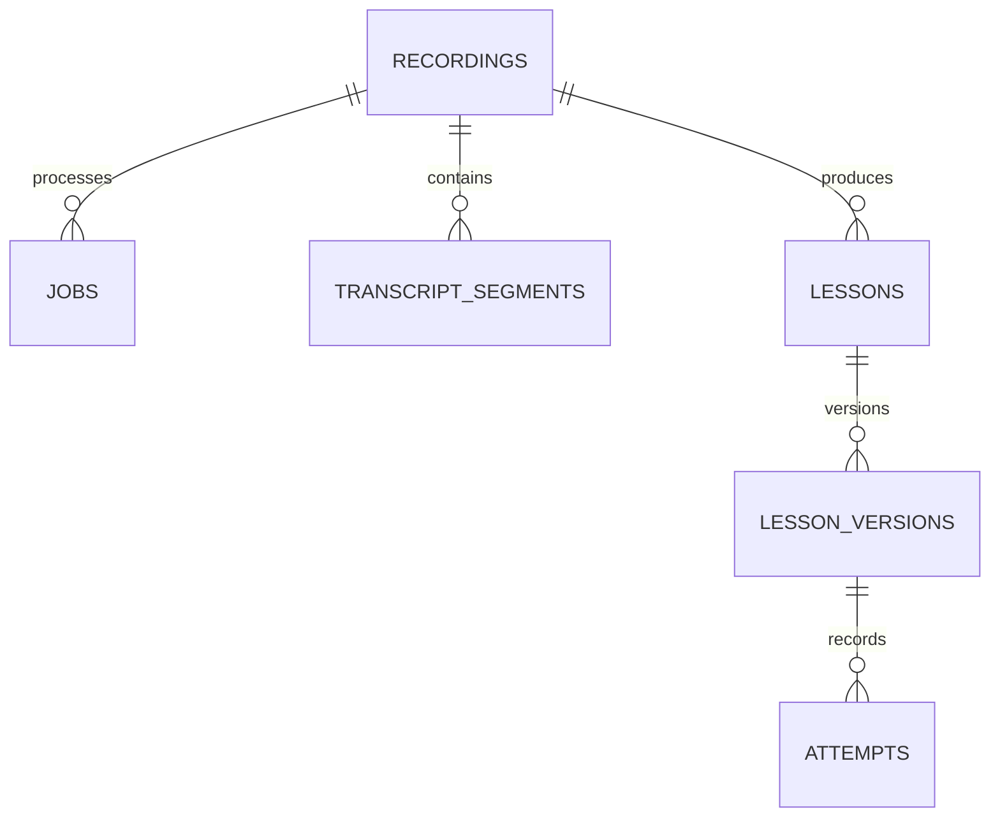
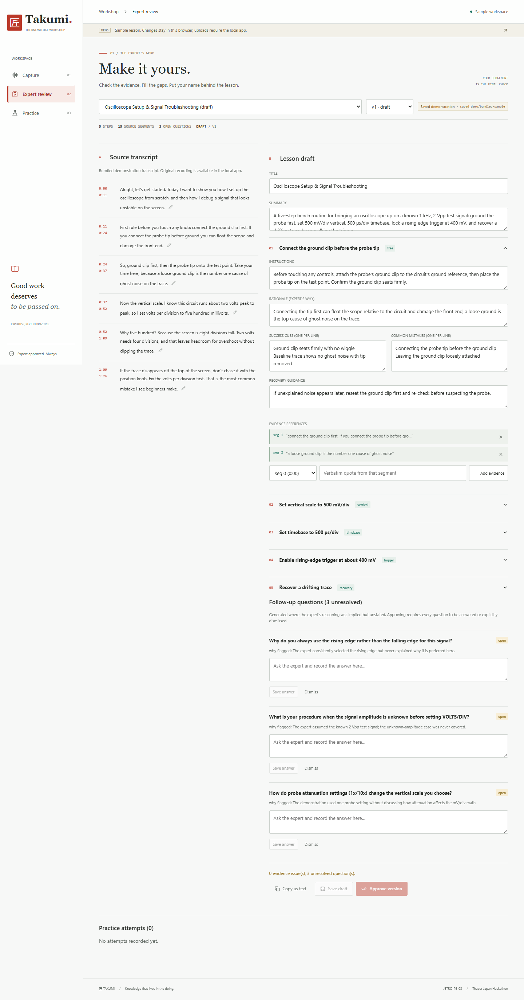

# Takumi

**Expert knowledge capture and guided apprenticeship.**

Takumi turns an expert's recorded demonstration into a draft lesson with transcript evidence, expert review, and guided practice. The goal is to preserve the decisions behind a task, not just the sequence of actions.

The current prototype focuses on electronics training through an interactive oscilloscope. It supports recordings up to **30 minutes** and **1000 MB** in the local app.

[Try the browser demo](https://takumi-two-kohl.vercel.app/) | [Verification report](docs/VERIFICATION.md) | [Design decisions](DESIGN.md)



> The Vercel site is a sample-only browser demo. Real recording uploads, transcription, and AI extraction run through the local Python backend. The demo does not upload your video to a hosted service.

## Contents

- [What Takumi Does](#what-takumi-does)
- [Two Ways to Run It](#two-ways-to-run-it)
- [Architecture](#architecture)
- [Processing Pipeline](#processing-pipeline)
- [Data Model](#data-model)
- [Expert Review and Approval](#expert-review-and-approval)
- [Guided Practice and Scoring](#guided-practice-and-scoring)
- [Quick Start](#quick-start)
- [Using Your Own Recording](#using-your-own-recording)
- [Configuration](#configuration)
- [API Reference](#api-reference)
- [Testing and Verification](#testing-and-verification)
- [Deployment](#deployment)
- [Privacy, Security, and Limitations](#privacy-security-and-limitations)
- [Troubleshooting](#troubleshooting)
- [Repository Guide](#repository-guide)
- [Roadmap](#roadmap)

## What Takumi Does

A video can show what an expert did without explaining why they did it. Takumi structures that knowledge into steps containing instructions, rationale, success cues, common mistakes, recovery guidance, and references to the source transcript.

| Workspace | Purpose |
| --- | --- |
| Capture | Upload audio/video, monitor background processing, and open the resulting lesson draft. |
| Expert review | Compare the draft with the source, correct transcript text, edit steps and evidence, resolve questions, and approve a lesson version. |
| Practice | Browse approved lessons, work through the simulator or read-and-continue steps, request expert hints, and save an attempt. |

The bundled sample covers oscilloscope setup and signal troubleshooting. Its audio is synthetic and its lesson is pre-authored. It is not a recording of a real expert, and the illustrative practice-library image is not source evidence.

Takumi originated as a prototype for the JETRO-PS-03 tacit-expertise preservation problem at the Thapar Japan Hackathon. It is a learning-workflow prototype, not a physical-skill certification system.

## Two Ways to Run It

| Capability | Local application | Vercel browser demo |
| --- | --- | --- |
| Frontend | React application served by FastAPI or Vite | Same UI built with `VITE_DEMO_MODE=1` |
| API implementation | Python/FastAPI | In-browser fetch interceptor |
| Storage | SQLite and files on the backend machine | Browser localStorage |
| Upload personal recordings | Yes, subject to limits and installed dependencies | No |
| Transcribe speech | Local faster-whisper | No model runs |
| Extract lessons | Ollama, NVIDIA NIM, or bundled sample | Bundled sample only |
| Review, approve, practice | Real API and persisted records | Simulated API and browser-local state |
| Share state between visitors | Not designed for multiple authenticated users | No, each browser has its own state |
| Offline use | Bundled sample after dependencies and frontend are installed | Not guaranteed by a service worker; none is implemented |

The local sample requires no API key. Custom recordings require transcription dependencies and a real extraction provider; `saved_demo` cannot process arbitrary uploads.

## Architecture

### Local Application



**Frontend.** [App.tsx](frontend/src/App.tsx) owns workspace navigation and connection state. Capture, review, and practice are separate page components. [api.ts](frontend/src/api.ts) wraps same-origin `/api` requests; the Vite development server proxies those requests to port 8000. The oscilloscope is a Canvas component, not a remote service.

**Backend.** [main.py](backend/app/main.py) assembles the routers, configures CORS and GZip, initializes storage, marks interrupted jobs as failed, and seeds the sample. It also serves `frontend/dist` when that directory exists at startup.

**Background work.** [jobs.py](backend/app/jobs.py) uses a single-worker `ThreadPoolExecutor`. Requests can return a recording/job identifier while processing continues. Job status is persisted in SQLite, but the execution queue is in memory. This is not a durable distributed queue: interrupted jobs are marked failed on restart and must be retried.

**Persistence.** [db.py](backend/app/db.py) uses Python's sqlite3 with WAL mode. Structured steps, questions, and attempt details are JSON stored in text columns. Media lives in the data directory, not in the database.

**AI boundary.** Speech transcription is local. Extraction uses a provider adapter. If hosted extraction is enabled, transcript text and the extraction prompt are sent to the configured endpoint; raw audio/video is not sent by this adapter.

### Browser Demo



[demoShim.ts](frontend/src/demo/demoShim.ts) is enabled at build time, not dynamically by the server. It implements the sample walkthrough without Python, SQLite, or a model. It is a demonstrator, not a replacement for all backend validation, version history, or security guarantees.

To reset the public demo, clear that site's stored browser data, or run this in its browser console and reload:

```javascript
localStorage.removeItem("takumi_demo_state_v1");
location.reload();
```

## Processing Pipeline

1. **Receive and store.** `POST /api/recordings` accepts multipart field `file`, checks its extension and byte limit, computes a SHA-256 digest, stores it under a generated identifier, and creates a background job. Empty or rejected oversized uploads are removed.
2. **Determine duration.** The worker checks a WAV header or uses ffprobe for container formats. A duration above 1800 seconds fails before transcription when it can be probed. If probing is unavailable, the transcription-reported duration is checked afterward.
3. **Transcribe.** faster-whisper produces timestamped English transcript segments using `small.en`, CPU INT8, beam size 1, and voice-activity filtering by default. The model is loaded lazily. Its first use may download model files.
4. **Extract.** The configured provider drafts a lesson from transcript segments. The bundled sample instead supplies its saved transcript and extraction, without running Whisper or a model.
5. **Validate.** Malformed output, invalid segment indices, and non-matching evidence quotes fail visibly rather than being silently discarded.
6. **Create a draft.** The lesson, draft version, provider/model provenance, and cache status are stored. The expert must review and approve it before trainee use.

```text
Job status:  queued -> running -> succeeded
                              -> failed

Stages: uploading -> transcribing -> extracting -> validating -> finalizing -> done
```

A successful upload response does not mean the lesson is ready. The frontend polls the job and displays its final error or review action. It polls active work every 1.5 seconds and idle recordings every 15 seconds, skipping hidden tabs.

### Provider Selection and Caching

| Provider | Purpose | Requirements |
| --- | --- | --- |
| `saved_demo` | Load the bundled sample's authored extraction | No model, key, or network; sample recording only |
| `ollama` | Extract with a local model | Running Ollama instance and a downloaded model |
| `nvidia` | Extract through NVIDIA NIM | API key and explicit enable flag |
| `auto` | Try enabled hosted extraction, then local extraction, then sample extraction when eligible | A real upload never falls back to fabricated sample content |

Explicit `nvidia`, `ollama`, and `saved_demo` requests do not silently switch to another provider. NVIDIA access requires both a nonempty key and `TAKUMI_NVIDIA_ENABLED=true`; this gate does not guarantee free usage. Check your account terms before enabling it.

Non-sample extraction results are cached by a SHA-256 key covering transcript data, provider, model, and prompt version. An unchanged cache hit avoids another generation request. Requests have configured timeouts and bounded retry counts; Ollama readiness probes are cached.

## Data Model

The arrows below describe logical ID relationships. They should not be read as a claim that every relationship has a database foreign-key constraint.



| Table | Stored information |
| --- | --- |
| `recordings` | Original filename, generated file path, media type, byte count, duration, sample flag, SHA-256 |
| `jobs` | Recording ID, state, stage, progress, error, selected provider/model, resulting lesson ID |
| `transcript_segments` | Segment index, start/end timestamps, original text, optional expert correction |
| `lessons` | Source recording and pointers to current and approved versions |
| `lesson_versions` | Version number, title/summary, steps/questions JSON, status, provenance, timestamps |
| `attempts` | Lesson/version IDs, trainee name, calculated score, duration, submitted step details |
| `extraction_cache` | Generation result, provider/model, and cache key |
| `meta` | Application metadata, including sample-seeding state |

Default runtime layout:

```text
backend/data/
  takumi.db
  recordings/
    <generated-recording-id>.<extension>
```

SQLite may also create WAL/SHM companion files. Back up recordings and the database together. Stop the backend before a simple filesystem backup, or use a SQLite-aware backup process. Runtime data, environment files, dependencies, and build outputs are git-ignored.

## Expert Review and Approval

A lesson step contains:

- The action to perform and its rationale.
- Observable success cues, common mistakes, and recovery guidance.
- Evidence references: a zero-based transcript segment index and a quote.
- An optional simulator task.

The review screen exposes the source transcript beside editable steps and follow-up questions. Draft edits are protected against accidental navigation.

The API validates references against both original and corrected transcript text. Matching normalizes text and accepts substring or fuzzy similarity matches. **This is a citation-consistency check, not proof that a claim is true, safe, or semantically supported.** An expert still needs to review the lesson.

Approval revalidates the stored content and requires every follow-up question to be answered or explicitly dismissed. Trainee endpoints expose the approved version, not an unapproved current draft.

Editing approved lesson content through the version-update endpoint creates a new draft. Existing attempts keep their stored version ID. This is application-level versioning, not a cryptographically immutable audit log; the question-answer endpoint can update question records on an existing version.



## Guided Practice and Scoring

The oscilloscope supports vertical scale, timebase, trigger enable/edge/level, and a disturbance-recovery task. Steps without a simulator task use guided read-and-continue. Feedback displays the lesson's expert rationale, mistakes, and recovery guidance.

For each submitted step:

```text
failed step contribution = 0
passed step contribution = max(0, 1 - 0.25 * wrong_adjustments - 0.15 * assists)
score = round(100 * average(submitted step contributions))
```

The backend checks that submitted step IDs belong to the approved version and recomputes the numerical score instead of accepting a client-supplied total. However, pass/fail flags and adjustment/hint counts come from the browser. The server does not independently replay the simulator or fully verify completeness and uniqueness of submitted steps. Scores are learning feedback, **not tamper-proof certification**.

The Canvas display bounds its backing resolution and avoids continuous redraw while paused, hidden, reduced-motion, or stably locked.

## Quick Start

The commands below use PowerShell from the repository root. Python 3.11+ and Node.js 18+ with npm are required. FFmpeg/ffprobe on PATH are recommended for container probing and required for the real-MP4 regression cases.

### 1. Clone and Install

```powershell
git clone https://github.com/ISHPREET0101/takumi.git
cd takumi

python -m venv backend/.venv
./backend/.venv/Scripts/python.exe -m pip install -r backend/requirements.txt
npm --prefix frontend ci
```

The backend requirements include API dependencies, faster-whisper, a PyAV compatibility constraint, and pytest. Installation requires internet access. If transcription dependencies cannot be installed, the sample can still run with an API-only environment:

```powershell
./backend/.venv/Scripts/python.exe -m pip install fastapi "uvicorn[standard]" python-multipart httpx pydantic python-dotenv pytest
```

That alternative does **not** enable real speech transcription.

### 2. Build the Local Frontend

```powershell
$env:VITE_DEMO_MODE = "0"
npm --prefix frontend run build
```

Build before starting the backend. `frontend/dist` is generated locally and is not shipped in Git. Explicitly using mode `0` avoids accidentally building the browser-only demo for a local upload workflow.

### 3. Start the Application

```powershell
./backend/.venv/Scripts/python.exe backend/run.py
```

Open [the local application](http://127.0.0.1:8000) or [interactive API docs](http://127.0.0.1:8000/docs). Startup seeds the bundled sample on a fresh data directory.

For the no-key sample walkthrough:

1. Open the sample in Expert review.
2. Inspect the transcript, steps, evidence, and three follow-up questions.
3. Answer or dismiss the questions, then approve the version.
4. Open Practice and complete the five sample steps.
5. Enter a trainee name, save the attempt, and inspect its result.

After initial installation and building, this local sample path does not require model downloads or network calls.

### Frontend Development

Keep the backend running and use a second terminal:

```powershell
$env:VITE_DEMO_MODE = "0"
npm --prefix frontend run dev
```

Open [Vite on port 5173](http://127.0.0.1:5173). Its `/api` proxy targets `http://127.0.0.1:8000`. Restart the backend after building a previously absent `dist` directory or changing backend configuration.

On macOS/Linux, use `backend/.venv/bin/python` instead of the Windows executable path and shell-appropriate environment assignment, for example `VITE_DEMO_MODE=0 npm --prefix frontend run build`.

## Using Your Own Recording

Use a consented recording containing clear English speech. Accepted extensions are `.mp4`, `.mov`, `.webm`, `.mkv`, `.m4a`, `.mp3`, `.wav`, `.ogg`, and `.flac`. Container acceptance does not guarantee that every codec or corrupt file can be decoded.

The default limits are independent: **at most 1800 seconds and 1000 MB**. A 30-minute video above the size cap still fails. The interface uses “1 GB” as shorthand; the backend implements 1000 times 1024 times 1024 bytes.

1. Install the full backend requirements and make ffprobe available.
2. Create `backend/.env` from [backend/.env.example](backend/.env.example) if it does not already exist. Never overwrite existing credentials unintentionally.
3. Configure a real extraction provider.
4. Restart the backend, upload the recording in Capture, and wait for its job.
5. Review the generated draft before approving it.

### Local Extraction with Ollama

With Ollama installed and running:

```powershell
ollama pull qwen2.5:7b
```

Set these values in `backend/.env`:

```dotenv
TAKUMI_EXTRACTION_PROVIDER=ollama
TAKUMI_OLLAMA_BASE_URL=http://localhost:11434
TAKUMI_OLLAMA_MODEL=qwen2.5:7b
TAKUMI_MAX_RECORDING_SECONDS=1800
```

Downloading the model requires a network connection; local generation does not require a hosted API. Runtime and memory requirements depend on the model and hardware. No 30-minute processing-time guarantee has been established.

### Hosted Extraction

For NVIDIA NIM, set the provider to `nvidia`, put your key only in the backend environment, and explicitly enable NVIDIA access. Use [the environment example](backend/.env.example) for the variable names. Never put a key in a `VITE_*` variable, source file, screenshot, or commit.

## Configuration

Configuration is loaded from process environment variables and optional `backend/.env`. Existing process values take precedence. Restart the backend after changing them.

| Variable | Default | Purpose |
| --- | --- | --- |
| `TAKUMI_DATA_DIR` | `backend/data` | Recording files and SQLite directory; use an absolute path for isolation |
| `TAKUMI_EXTRACTION_PROVIDER` | `saved_demo` | `saved_demo`, `ollama`, `nvidia`, or `auto` |
| `TAKUMI_WHISPER_MODEL` | `small.en` | Local English speech model |
| `TAKUMI_MAX_RECORDING_SECONDS` | `1800` | Duration limit; old explicit overrides must be changed manually |
| `TAKUMI_MAX_UPLOAD_MB` | `1000` | Backend byte cap in units of 1024 x 1024 bytes |
| `TAKUMI_OLLAMA_BASE_URL` | `http://localhost:11434` | Ollama endpoint |
| `TAKUMI_OLLAMA_MODEL` | `qwen2.5:7b` | Ollama model |
| `TAKUMI_NVIDIA_API_KEY` | Empty | Backend-only hosted credential |
| `TAKUMI_NVIDIA_ENABLED` | `false` | Explicit hosted-provider opt-in |
| `TAKUMI_NVIDIA_BASE_URL` | `https://integrate.api.nvidia.com/v1` | Hosted API base |
| `TAKUMI_NVIDIA_MODEL` | `meta/llama-3.1-8b-instruct` | Hosted model identifier |
| `TAKUMI_LLM_TIMEOUT_SECONDS` | `60` | Timeout per generation request |
| `TAKUMI_LLM_MAX_ATTEMPTS` | `2` | Maximum attempts per provider request |
| `TAKUMI_LLM_MAX_TOKENS` | `3000` | Generation token budget |

The capture UI currently displays the default 30-minute/1-GB limits rather than reading custom backend limits dynamically. If an operator changes backend caps, that display may differ from enforcement.

Frontend `VITE_DEMO_MODE` is a **build-time** flag: `1` enables the browser sample; `0` uses the real API. Rebuild after changing it.

## API Reference

Base: `http://127.0.0.1:8000/api`. Interactive request/response schemas are at [Swagger UI](http://127.0.0.1:8000/docs); machine-readable schemas are at `/openapi.json`.

| Method | Path relative to /api | Purpose |
| --- | --- | --- |
| GET | Base URL `/api` | Application information |
| POST | `/recordings` | Multipart upload and job creation |
| GET | `/recordings` | Recording register with latest job |
| GET | `/recordings/{id}` | Recording details and transcript |
| GET | `/recordings/{id}/media` | File streaming with Range support |
| PATCH | `/recordings/{id}/transcript/{seg}` | Correct a transcript segment |
| POST | `/recordings/{id}/reprocess` | Retry/reprocess; rejects an already active job |
| GET | `/lessons` | Expert-facing lesson list |
| GET | `/lessons/{id}` | Versions, source transcript, and attempt history |
| GET | `/lesson-versions/{id}` | Version content |
| PUT | `/lesson-versions/{id}` | Save draft or create a draft from approved content |
| POST | `/lesson-versions/{id}/questions/{qid}` | Answer or dismiss a follow-up |
| POST | `/lesson-versions/{id}/approve` | Validate and approve |
| GET | `/lessons/{id}/attempts` | Expert-facing attempt details |
| GET | `/trainee/lessons` | Approved lessons only |
| GET | `/trainee/lessons/{id}` | Approved version; 403 if unavailable |
| POST | `/trainee/lessons/{id}/attempts` | Submit and store a scored attempt |
| GET | `/trainee/lessons/{id}/attempts` | Attempt summaries; optional `trainee` query |
| GET | `/health` | Provider/transcription readiness |

For example, from the repository root:

```powershell
curl.exe -F "file=@C:/recordings/demonstration.mp4" http://127.0.0.1:8000/api/recordings
```

Replace the example path with an existing consented recording. Upload validation returns 415 for unsupported extensions, 422 for empty uploads, and 413 for oversized files. Duration, decoding, extraction, and evidence failures normally appear in the asynchronous job error after the upload response.

## Testing and Verification

Latest completed full verification: **2026-10-08, 24 backend tests passed, none failed or skipped**. Both frontend production modes and native/public browser walkthroughs passed. These are dated results, not a live CI badge.

```powershell
./backend/.venv/Scripts/python.exe -m pytest backend/tests -q
$env:VITE_DEMO_MODE = "0"
npm --prefix frontend run build
$env:VITE_DEMO_MODE = "1"
npm --prefix frontend run build
```

Tests isolate their database and provider settings. Model calls are stubbed, so tests do not need API keys or model downloads. The real-MP4 tests require ffmpeg and ffprobe; those cases skip when the executables are unavailable.

The build commands leave `dist` in browser-demo mode. Rebuild with `VITE_DEMO_MODE=0` before returning to local uploads.

Coverage includes approval gating, approved-only trainee access, evidence checks, version-linked attempts, score recomputation, persistence, interrupted jobs, provider failures and caching, transcript edits, media Range requests, invalid-upload cleanup, and duration boundaries.

**Real-media boundary verification:** synthetic MP4s at 30:00 and 30:01 were fully decoded with FFmpeg and uploaded through the API. The first reached a draft with simulated model calls; the second failed before transcription. This verifies upload/probing behavior, **not real speech recognition or lesson quality**.

The latest backend environment did not have faster-whisper installed. Real 30-minute expert speech transcription, live hosted extraction, and end-to-end processing performance were not verified in that pass. Older verification notes are historical, not evidence that every current environment has those capabilities.

### Browser Regression Script

With Playwright and a compatible Edge installation available, run from the repository root:

```powershell
$env:BASE_URL = "http://127.0.0.1:8000"
$env:OUTPUT_DIR = "backend/data/browser-verification"
node scripts/verify-ui.cjs
```

If Playwright is installed outside the project, set `PLAYWRIGHT_MODULE` to its module path. The script defaults to the `msedge` channel, configurable with `BROWSER_CHANNEL`.

**Use a fresh sample and isolated data.** This script edits a draft, answers questions, approves it, and saves an attempt. Set `TAKUMI_DATA_DIR` to a temporary data directory before starting a local verification server. Its default screenshot output is `docs/screenshots/refined`; set `OUTPUT_DIR` as above to avoid modifying tracked screenshots. For the public demo, a fresh browser context keeps its changes browser-local.

Full commands, evidence, and limits: [docs/VERIFICATION.md](docs/VERIFICATION.md).

## Deployment

### Current Vercel Deployment

[The public site](https://takumi-two-kohl.vercel.app/) serves only the browser sample. [frontend/vercel.json](frontend/vercel.json) sets:

```json
{
  "framework": "vite",
  "buildCommand": "VITE_DEMO_MODE=1 npm run build",
  "outputDirectory": "dist",
  "cleanUrls": true
}
```

For a new Vercel import, use repository root directory `frontend`. With the Vercel CLI installed and authenticated, deploy from that directory using `vercel deploy --prod`. No backend credentials are needed for the sample.

### Hosting the Full Application

The repository does not currently deploy a public upload backend. Hosting the full app requires a persistent Python service, storage for recordings and SQLite, transcription/model resources, an extraction provider, and a long-running worker. The current in-process worker and local filesystem cannot simply be moved into the existing static Vercel deployment.

Before exposing the backend publicly, add authentication and authorization, TLS, quotas/rate limits, consent and retention controls, backup/recovery procedures, and an appropriate persistent job/storage design. A separate frontend also requires deliberate API URL/proxy and CORS configuration; there is no documented hosted-backend URL switch today.

## Privacy, Security, and Limitations

- The default backend binds to `127.0.0.1`; media and data stay on that backend machine. If hosted elsewhere, “local” means the server, not automatically the visitor's device.
- Hosted extraction can send sensitive transcript content to a third party. Obtain consent and review provider terms before enabling it.
- Secrets belong in the backend environment. Git ignores `.env`, runtime data, dependencies, build outputs, and local deployment metadata.
- There are no user accounts, authentication, role-based access controls, or tenant isolation. Expert/trainee routes organize workflows; they are not identity boundaries.
- Database files and recordings are not encrypted by the app. There is no built-in retention policy, deletion UI, or managed backup service.
- Evidence matching is fuzzy and structural, not a truth/safety guarantee. The simulator is an educational approximation, not an electrical safety assessment.
- Scoring depends on client-reported events and does not establish physical competence.
- The job executor is single-process and in-memory. Reprocessing creates another draft lesson, and interruption requires explicit retry.
- English speech and one simulator domain are the current focus. Longer recordings can exceed a model's useful context/output budget despite being within the upload limit.
- Vite 5/esbuild development-tool advisories remain a known dependency-upgrade task. The README does not claim a clean security audit.
- Pitch-deck binaries in `docs` may retain earlier limits; changing [scripts/make_deck.js](scripts/make_deck.js) does not regenerate the PPTX/PDF automatically.

## Troubleshooting

| Symptom | What to check |
| --- | --- |
| Upload disabled on Vercel | Expected: the public deployment is sample-only. Run the local app for uploads. |
| Local app behaves like the browser sample | Rebuild with `VITE_DEMO_MODE=0` and restart the backend. |
| Root page says frontend is not built | Run the frontend build before starting/restarting FastAPI. Git does not contain `dist`. |
| “faster-whisper is not installed” | Install full backend requirements in the same environment used to launch the server. |
| First transcription is slow | The model is lazy-loaded and may need its initial download; CPU processing time depends on hardware. |
| Upload accepted, job later fails | Inspect the recording's job error: probe, codec, transcription, provider, and validation failures are asynchronous. |
| “saved_demo extraction is only available...” | Configure Ollama or explicitly enabled NVIDIA for your own recording. |
| Ollama unavailable | Confirm the service URL, running instance, and exact downloaded model name. |
| A 30-minute video is rejected | Check bytes as well as duration, the effective `TAKUMI_MAX_RECORDING_SECONDS` override, and restart after changes. |
| Cannot approve a lesson | Resolve questions and correct invalid evidence references; save outstanding edits first. |
| Practice does not show a draft | Expected: only approved versions are served. |
| Demo already has edits/attempts | Reset that site's localStorage; demo state is per browser. |
| Real-media tests skipped | Put both ffmpeg and ffprobe on PATH and rerun the suite. |
| Port already in use | Stop the known owner or launch an isolated backend with a different port; update the frontend proxy if necessary. |

## Repository Guide

```text
takumi/
  backend/
    app/
      main.py                   App startup, middleware, routers, static hosting
      config.py                 Environment configuration
      db.py                     SQLite schema and helpers
      jobs.py                   Background processing pipeline
      seed.py                   Bundled sample and synthetic audio
      schemas.py                Pydantic request contracts
      routers/                  Recordings, expert lessons, trainee, health
      services/
        transcription.py        Local Whisper and duration probing
        extraction.py           Providers, prompts, retry logic, cache, quote matching
        validation.py           Output and evidence validation
    fixtures/                   Bundled transcript and authored extraction
    tests/test_workflow.py      API, workflow, and real-media regression coverage
    requirements.txt
    run.py
  frontend/
    src/
      App.tsx                   Workspace navigation and connection status
      api.ts                    API client
      types.ts                  Frontend request/response types
      pages/                    Capture, Review, Practice
      components/               Oscilloscope, provenance badge, error boundary
      demo/                     Browser API shim and sample data
      styles.css                Shared workshop UI
    public/                     Favicon and illustrative practice image
    package.json
    vite.config.ts              Development proxy
    vercel.json                 Static sample deployment
  scripts/
    verify-ui.cjs               Browser workflow and responsive regression checks
    make_deck.js                Pitch-deck source
  docs/
    VERIFICATION.md             Dated checks and limitations
    UI-REFINEMENT.md            UI implementation and verification notes
    FRONT-PAGE-PHOTO.md         Photo-removal history
    screenshots/               Tracked demonstration images
  DESIGN.md                     UI design source of truth
  LICENSE
```

For changes, keep the capture -> review -> approval -> practice contract intact, use isolated test data, and run relevant backend/build/browser checks before pushing. Never commit recordings, credentials, local databases, or model files.

## Roadmap

- Capture a consented, original expert demonstration and evaluate transcription quality.
- Benchmark real long-recording processing on stated hardware and providers.
- Measure learning outcomes against written instructions without treating simulator scores as certification.
- Strengthen authentication, audit history, attempt verification, and storage controls before multi-user hosting.
- Add transcript chunking, a durable worker queue, and more simulator domains when needed.
- Verify dependency upgrades and regenerate presentation artifacts from current project state.

## Team and License

Maintained by [ISHPREET0101](https://github.com/ISHPREET0101) and collaborators. Add the final team roster to submission materials separately.

Built with React, TypeScript, Vite, Lucide, FastAPI, SQLite, faster-whisper, and optional Ollama/NVIDIA integrations.

Released under the [MIT License](LICENSE).
